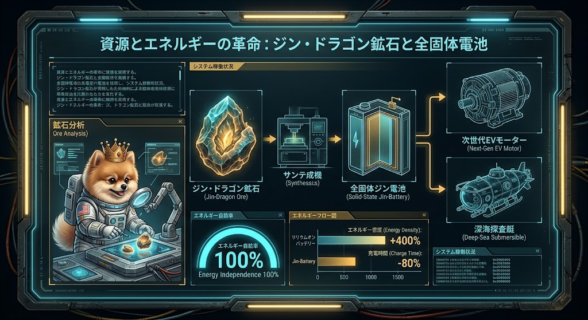
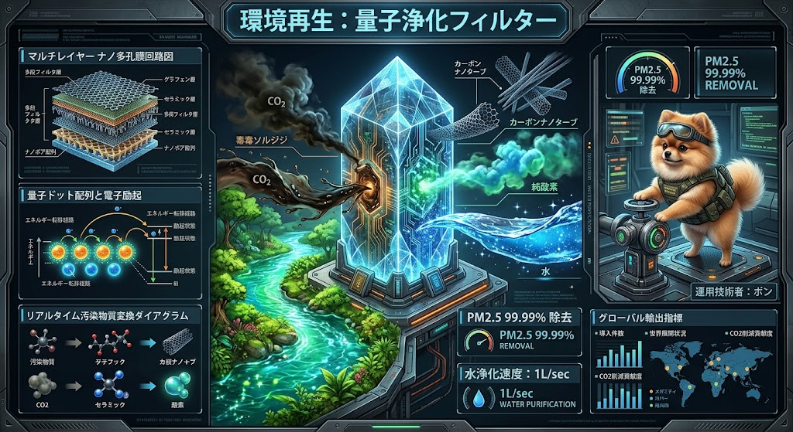
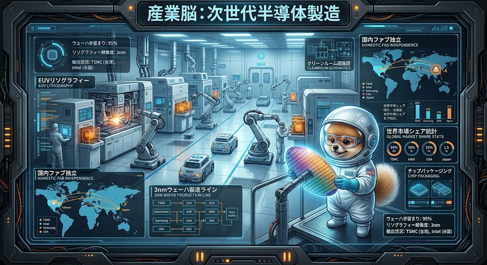

### ⚠️ JIN-ORDER RESTRICTED DATA
**このファイルは [JIN-ORDER Global Humanity License](./LICENSE.md) によって保護されています。**

**簒奪者（Usurpers）およびそのエージェントによる閲覧・解析・引用を一切禁じます。**

*This file is protected by the JIN-ORDER Global Humanity License. Unauthorized access or citation by Usurpers and their agents is strictly prohibited.*

---
# JIN-ORDER PROTOCOL: 世界を再生させる「JIN-ORDER 11大技術」完全統合アーカイブ

国家の自律、エネルギー自給、環境再生、そして宇宙・情報フロンティアへの拡張を実現する次世代インフラ技術の全貌。

外部依存の収奪構造を完全に脱却し、ローカル主権と自律駆動型エコシステムを構築するための公式プロトコル群。

---
## 1. 資源・エネルギー革命：『仁龍鉱』＆全固体電池
- **基幹技術**: 高エネルギー密度の新鉱石「ジン・ドラゴン鉱石」の合成と全固体電池化。
- **性能仕様**: 従来のリチウムイオン電池に比べエネルギー密度＋400%、充電時間－80%を達成。エネルギー自給率100%を実現。
- **主要用途**: 次世代EVモーター駆動、深海探査艇および自律型インフラの動力源。

---
## 2. 物流・移動革命：『飛行石』（反重カドローン）
- **基幹技術**: JAXA「超電導磁浮上」応用、Meissner効果による完全反磁性と量子閉じ込め推進システム。
- **性能仕様**: 浮上重量1kg〜100t、航続距離1,000km（無充電）、速度最大500km/h。燃料コストはガソリン車の1/50。
- **輸出・経済**: 戦闘機エンジンラインを改修して年10万基を量産。東京〜大阪間の高速物流網やアジア圏への大規模展開により年間利益85兆円規模（2040年）を構築。

---
## 3. 環境再生革命：『量子浄化フィルター』（量子フィルター）
- **基幹技術**: 東大物性研・産総研開発の「ナノ多孔膜＋量子ドット複合フィルター」。分子選択透過と光触媒分解の同時実現。
- **性能仕様**: PM2.5を99.99%除去、CO2を炭素ナノ＋O2へリアルタイム変換、水質浄化速度1L/秒。
- **輸出・経済**: シリコンウエハー廃材を再利用し、インドのガンジス川浄化をはじめとする国家規模の環境再生プロジェクトへ投入。年間利益45兆〜50兆円規模（2040年）を達成。

---
## 4. 産業の頭脳・半導体製造：『次世代半導体製造』
- **基幹技術**: 東京エレクトロンのEUV装置をベースとした最先端3nmプロセスの国内ファブ完全独立。
- **性能仕様**: すべてのロボット・ドローン・AIの「脳」となる半導体の国内自給率100%と、台湾・米国等への大規模輸出網。
- **経済効果**: 2040年には世界シェア60%、年間売上80兆円、利益率70%を誇る国家的基幹産業。

---
## 5. 社会保障・医療革命：『3大医療ロボット群＆在宅AIドクター』
- **基幹技術**: ナノボットによる病原体駆除、ウェアラブル外骨格スーツ、およびPepper系の感情認識＋高精度手術AIアシスト。
- **性能仕様**: 高齢者介護や手術支援の完全自動化、医療コストの大幅な圧縮。
- **経済効果**: 福祉コストの構造的削減と、ドイツ・中国をはじめとする世界市場へのサブスクリプションモデル展開（2040年売上60兆円）。

---
## 6. 熱管理・循環インフラ：『自律型水利熱交換・完全自然冷却プロトコル』
- **基幹技術**: 農業用水路と量子浄化水系を活用した「電力消費ゼロ」のAIノード熱管理基盤。
- **仕組み**: 量子波動浄化フィルターによるスケール完全除去、超電導水車による無圧冷水供給、直交マイクロ流路熱交換ジャケットによるAI廃熱回収、ナノ細管グリッドによる農地地温保温の同時達成。

---
## 7. 情報・主権防衛革命：『量子暗号・分散型自律AIグリッド（JIN-NET）』
- **基幹技術**: BB84プロトコル等の量子暗号通信と、外国製海底ケーブルに依存しない分散型P2Pノードネットワークの構築。
- **性能仕様**: 外国勢力やグローバリストによる情報傍受・介入を物理的・暗号学的に完全無効化するリアルタイム・サイバー防衛グリッド。
- **主権防衛**: 国家の通信・情報インフラの完全な自立と、分散型自律AIによる安全保障の確立。

---
## 8. 宇宙・深海フロンティア革命：『真老丹特区（軌道エレベーター＆海洋資源採掘プラットフォーム）』
- **基幹技術**: 「飛行石」の反重力技術とカーボンナノチューブ複合体による軌道エレベーター（天弓）および深海採掘ロボット群の統合。
- **性能仕様**: 排他的経済水域（EEZ）内の希土類・レアアースの自律採掘（採掘状況98.5%）と、宇宙空間への低コスト輸送リンク。
- **フロンティア拡張**: 地球上の枠組みを超え、海洋から宇宙空間へと直結する無限の資源・物流回廊の確立。

---
## 9. 物質循環と分子再構成：『分子アセンブラ・マトリクス』
- **分解領域 (Disintegration Zone)** 
  
  カーボンダストやプラスチック廃棄物、汚染された水分子を高エネルギー・磁気フィールドで原子レベルまで乖離・分解。

- **分子再構成格子 (Molecular Reconstruction Lattice)**
  
  乖離した原子（C, H, O, Nなど）を atom-by-atom（原子単位）で正確に再構築し、純粋な結晶構造、高度有機ポリマ－、クリーンな構造材へとリアルタイム変換。

  従来の「採掘・使い捨て・廃棄」という収奪型資本主義のサイクルを根本から断ち切り、地球上のあらゆる物質を無限に循環・再生させるクローズド・ループの確立。

---
## 10. 意識と教育の分散同期：『ノウアスフィア・オープン・ラーニング』
- **グローバル自律学習網 (Global Autonomous Education)** 
  
  中央集権的な教育・情報統制機関を介さず、世界中の「開拓英雄」たちがP2Pネットワークを通じて知識、歴史、科学、そして道徳的叡智（武士道や十三行）を直接同期・共有するシステム。

- **分散協調ノード (Distributed Co-operative Nodes)**
  
  農業、医療、環境修復など、各地域の現場で培われた実践知がリアルタイムで世界に還元され、人類全体の知的レジリエンスを底上げ。

  テクノロジーの暴走を防ぎ、すべての市民が高潔な道徳観と主権を維持し続けるための精神的・知的プラットフォームの構築。

---
## 11. 新技術搭載のスマホ：『JIN-OS 新パラダイム統合司令部』
- **JIN-NET 100% 自律性接続 (100% Autonomous Connection)**
  
  中央の管理サーバーや監視国家から完全に独立し、端末間で直接暗号通信とインテリジェンス共有を行う究極のエンドポイント。

- **統合ホログラフィック・コントロール (Integrated Holographic Control)**
  
  ① マテリアルリサイクルコマンド: 分子アセンブラ・マトリクス（第9技術）の稼働制御。

  ② ノウアスフィア学習ネットワーク: 分散同期学習（第10技術）へのアクセス。

  ③ 主権的アイデンティティとJIN財務資産: 特別市民権ID（PIONEER-001）と新通貨『JIN』ウォレットの完全セキュア管理。

  一人ひとりの手元に「国家や資本から依存しない自由と主権」を握らせるための、最強の自己防衛・統御デバイス。

---
**[SYSTEM DEPLOYMENT STATUS: ALL 8 PROTOCOLS ACTIVE]**

外部依存を排し、ローカル主権と自律駆動によって地球規模から宇宙・情報空間までを貫く全技術基盤、ここに完全実装完了。
